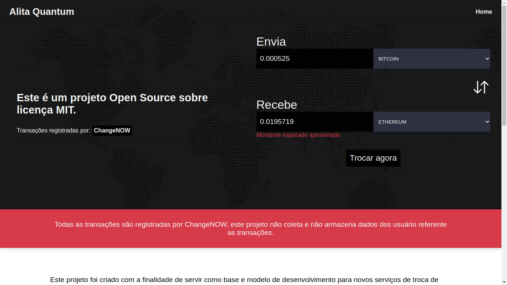
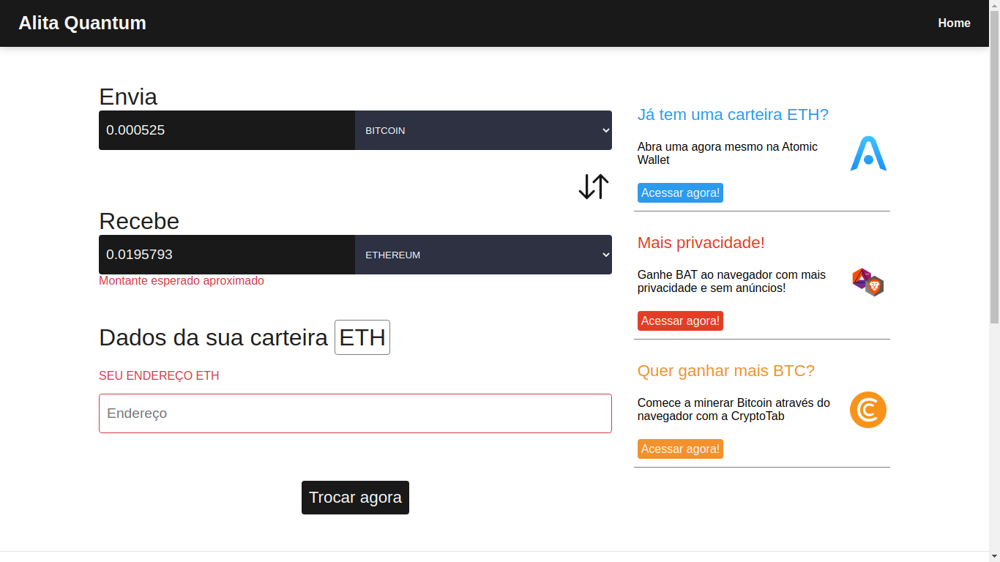
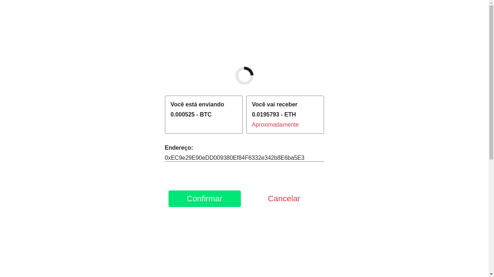
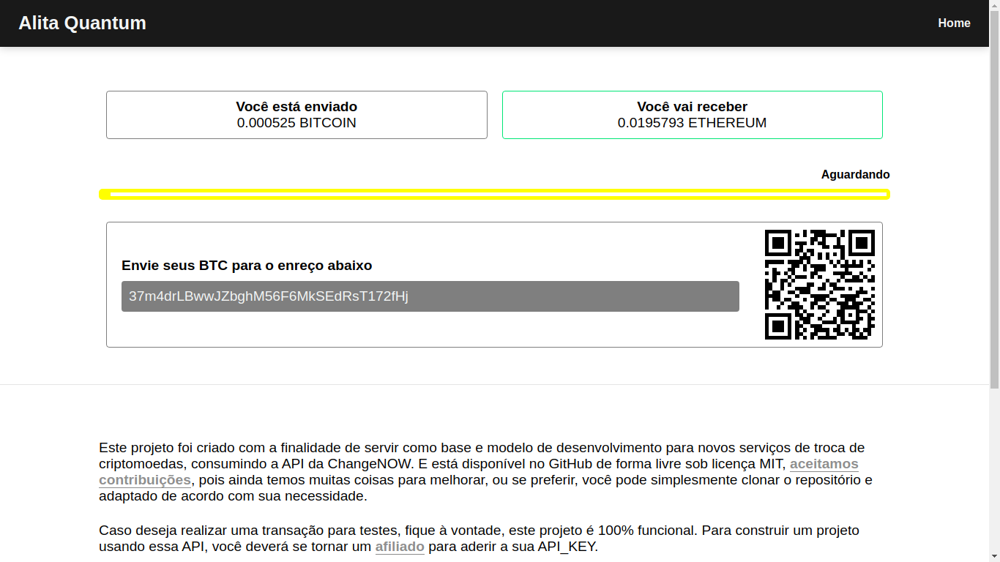

# Alita Quantum

Este projeto foi criado com a finalidade de servir como base e modelo de desenvolvimento para novos serviços de troca de criptomoedas, consumindo a API da ChangeNOW. E está disponível no GitHub de forma livre sob licença MIT, aceitamos contribuições, pois ainda temos muitas coisas para melhorar, ou se preferir, você pode simplesmente clonar o repositório e adaptado de acordo com sua necessidade.

Caso deseja realizar uma transação para testes, fique à vontade, este projeto é 100% funcional. Para construir um projeto usando essa API, você deverá se tornar um afiliado para aderir a sua API_KEY.

## Tecnologias / Pacotes

- ReactJS (TypeScript)
- React Helmet
- Axios
- Styled Components
- React QR SVG

## API

- ChangeNOW API - <https://changenow.io/api/docs>

## Imagens

|                           |                           |
| ------------------------- | ------------------------- |
|  |  |
|  |  |

## Em breve mais informações e mais funcionalidades

## Doar

| Moeda        | Endereço                                   | Suporte |
| ------------ | ------------------------------------------ | ------- |
| Bitcoin      | 1BLMprjuKknqPnTcaUVXdrCZFNE8tPr9R4         |         |
| Ethereum     | 0xEC9e29E90eDD009380Ef84F6332e342b8E6ba5E3 | ERC20   |
| Binance Coin | bnb1yf00q49nkry6uelqpwln2j4fx6htqcqllw0g0g | AWC986  |
